# Week 1 - Refreshers

Welcome back, explorers! <br>
Let's dive into some Python magic and see what awesome things we remember from last year. Ready for a fun challenge?

## Python

### Online playground

- [Online Python](https://www.online-python.com/)
- [trinket](https://trinket.io/python)
- [W3 schools](https://www.w3schools.com/python/trypython.asp?filename=demo_default)

??? tip "Share your code"

    Some of those online playgrounds give a unique URL for your code, so you can share your code with others.

### Basics

Following contents are from Coach Kiran's material from the last academic year.

#### Python vs. Scratch

!!! example ""

    ✏️ How are they different?

#### "Hello World"

Type the following script in one of the online playground and **Run**.  

```python
print("Hello, World!")
```

!!! example ""

    ✏️ Replace "Hello World" with another sentence, and run again.

#### Syntax

Conditionals, Loops, Methods declarations end with a `:`.

```python
if (a < 4):
```

Use spaces to indicate a block of code.
4 spaces is the accepted convention.

```python
if 2 < 10:
    print("2 is less than 10")
```

#### Functions

A function is a block of code which only runs when it is called.

!!! example ""

    ✏️ Try it:

    ```python
    def function_1():
        print("hello from function 1")

    def function_2():
        print("hello from function 2")

    function_1()
    ```

#### Variables

Variables are containers with names for storing values

*Example:*

```python
robot_name = "electrobot"
robot_speed = 100
```

!!! example ""

    ✏️ Try it:

    ```python
    my_fancy_text = "not all who wander are lost"
    print(my_fancy_text)
    ```

#### Constants

Constants are a type of variable whose values don’t change.

*Example:*

```python
ROBOT_WHEEL_DIAMETER_MM = 50
ROBOT_AXLE_LENGTH_MM = 100
```

!!! example ""

    ✏️ Try it:

    ```python
    MY_CONSTANT = 42
    print(MY_CONSTANT)
    ```

#### Booleans

Booleans represent one of TWO values: `True` or `False`

!!! example ""

    ✏️ Try it:

    See what is printed when you try these statements

    ```python
    print(10 > 9)
    print(10 == 9)
    print(10 != 9)
    print(10 < 9)
    ```

#### Loops

Loops allow us to execute a command many times.
While loop to begin with.

!!! example ""

    ✏️ Try it:

    ```python
    counter = 0
    while (counter < 10):
        print(“value of”, counter)
        counter += 1

    print(counter)
    ```

#### Conditionals

Conditionals allow us to execute code based on certain conditions.


!!! example ""

    ✏️ Try it:

    ```python
    x = 10
    if x < 10:
        print("x is less than 10")
    elif x > 10:
        print("x is greater than 10")
    else:
        print("x is equal to 10")
    ```

### Resources

- [Python Tutorial on W3 schools](https://www.w3schools.com/python/)

## Pybrick

### Getting Started

Go to [`https://beta.pybricks.com`:octicons-link-external-16:](https://beta.pybricks.com){:target="_blank"}.

You should see a page like this in your browser window.
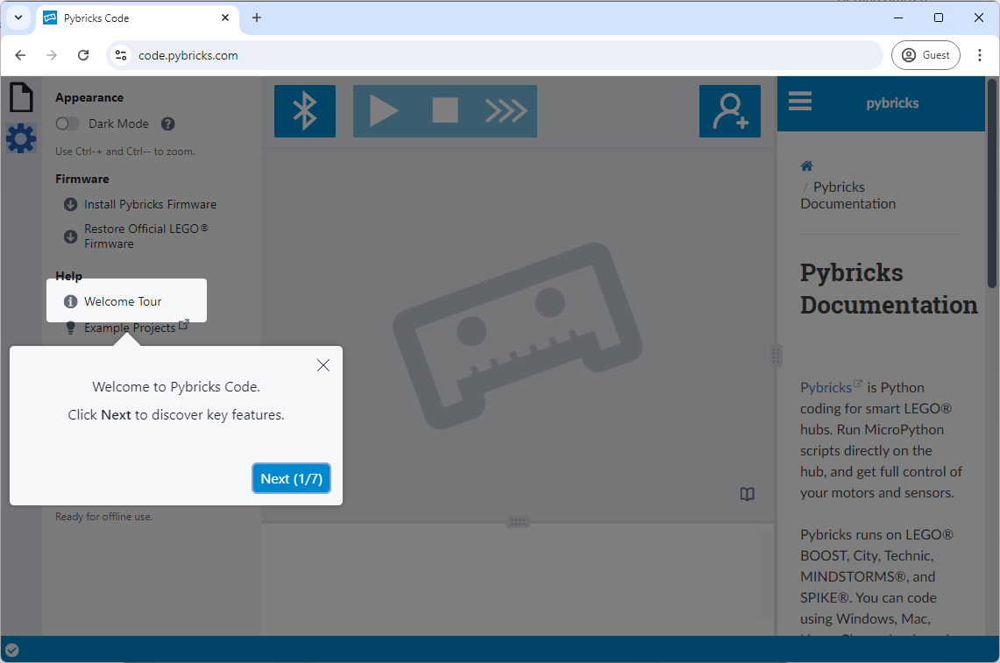

??? tip "Install locally on your computer"

    You can "install" Pybricks Code on your computer so you can start using it easily and even without the Internet.

    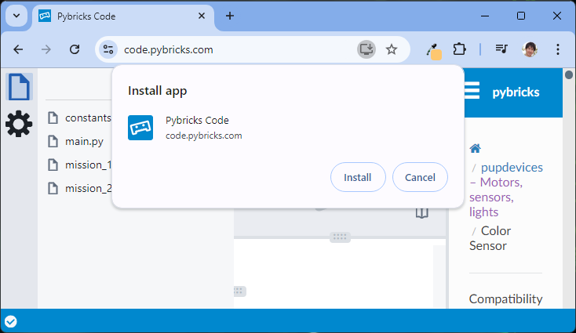

### Install/Update Pybricks firmware

??? note "Prerequisite: USB driver install"

    If you are Windows user, and if this is your first time installing or updating the firmware on yoru Windows PC, first check if you have the right USB driver for the Hub.

    Open "Device Manager" and check if how "**LEGO Technic Large Hub in DFU Mode**" appears.

    If it appears with yellow triangle sign (⚠️), like the following, you need to install the USB driver first.

    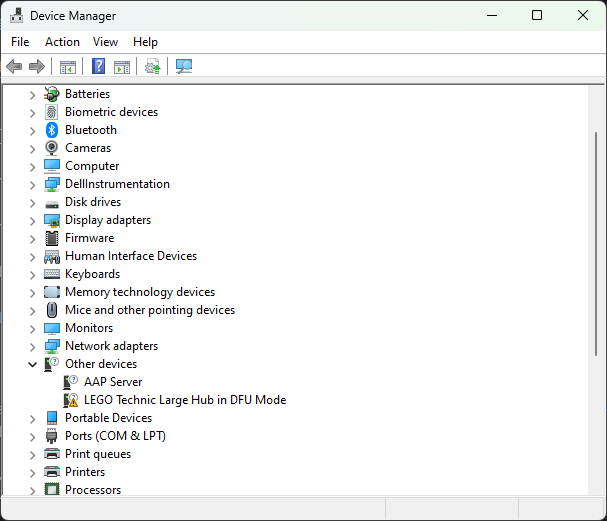

    To find the instruction for installing the USB driver, start the "Install Pybricks Firmware" process by the following steps;

    1. Click :gear:(gear icon) on the left side bar, 
    1. Under "**Firmware**" section, click "**Install Pybricks Firmware**"
    1. Skip through the Step :material-numeric-1-circle: to :material-numeric-3-circle: by hitting "**Next**" button
    1. On "**Step :material-numeric-4-circle:**", at the very bottom, click on "Click for instructions".

        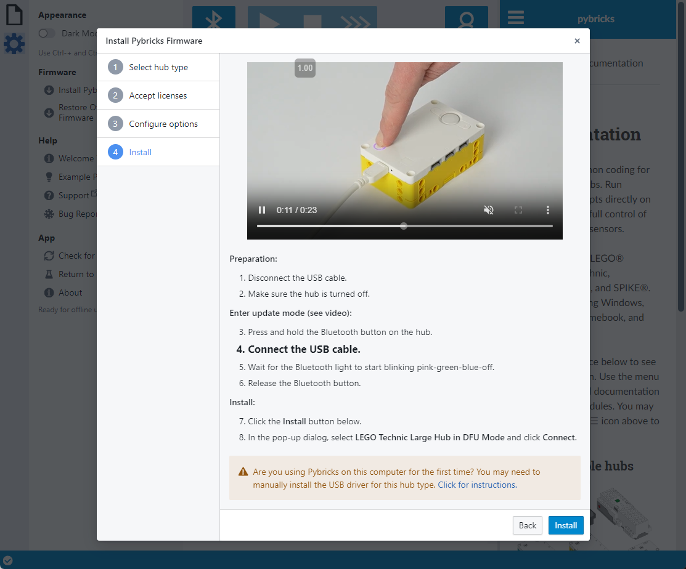

    1. "Windows DFU USB driver installation instuctions" appears in the screen. Follow this guide and perfom the actions on your Device Manager. 

        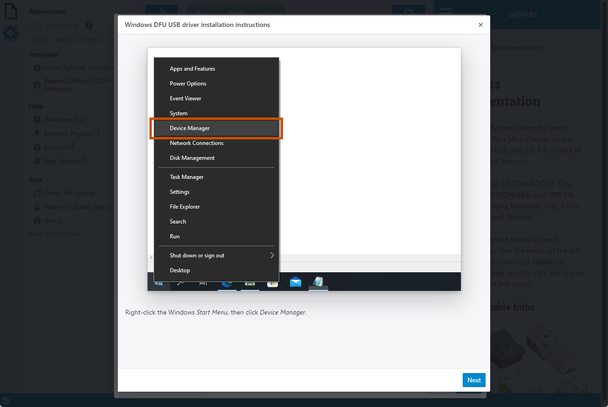

#### Install / Update steps

=== "First time use :octicons-arrow-right-16: Fresh install"

    If this is your first time using your SPIKE Prime Hub (or MINDSTORMS Robot Inventor Hub) with Pybricks, 
    start the "Install Pybricks Firmware" process by the following steps;

    - Click :gear:(gear icon) on the left side bar, 
    - Under "**Firmware**" section, click "**Install Pybricks Firmware**"

    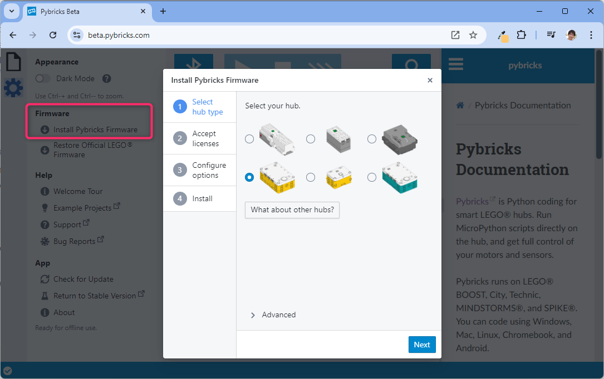

    Follow the on-screen guide (Step :material-numeric-1-circle: to :material-numeric-4-circle:) to install the new Pybrick firmware on your Hub.

=== "Update"

    If you had installed the custom Pybrick firmware on your Hub a while ago, you may get this message when connect to your Hub.

    

    Hit the "**:material-arrow-down-circle: Update Pybricks firmware**" button to start the "Install Pybricks Firmware" process.

### Pybricks UI

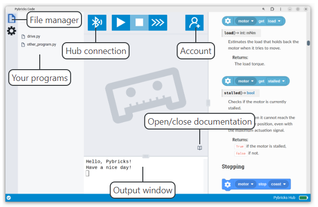

### How to connect

1. Turn on the SPIKE Prime Hub (or MINDSTORMS Robot Inventor Hub) by pressing the big circular button.
1. On Pybricks Code, click the Bluetooth button (:material-bluetooth:)

    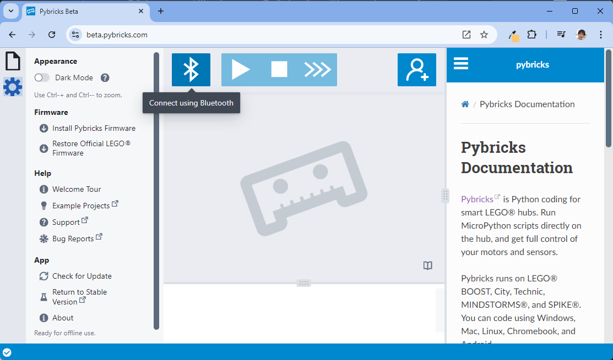

1. Your Hub should appear in the list. Select it and hit "**Pair**" button.

    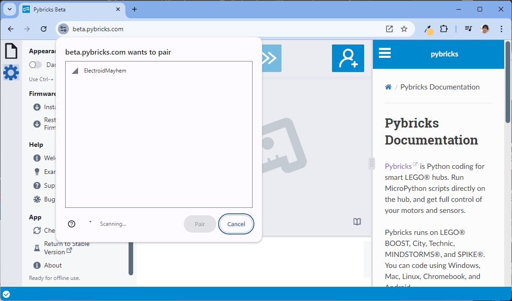

1. Make sure your Hub is connect by checking the Bluetooth button (it should now look like :material-bluetooth-audio:)

    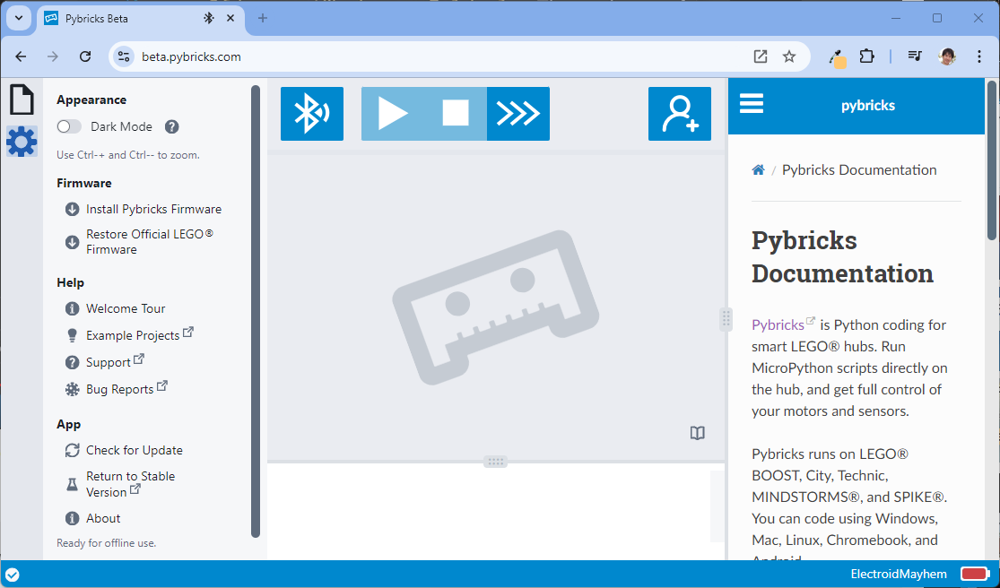

### How to code (and run on Hub)

1. Click on **:octicons-file-16: (File)** button on the left side bar

    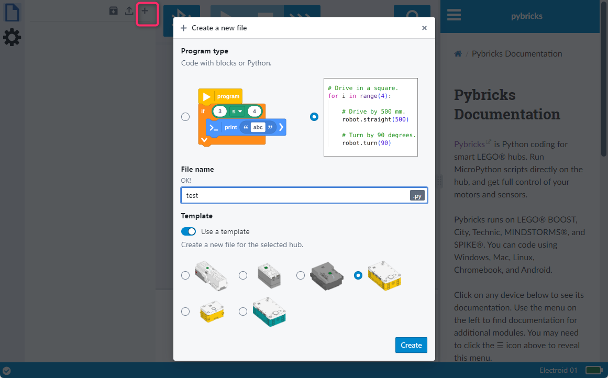

1. On "Create a new file" dialog, 

    - For "**Program type**", select "Python" (left)  
    - For "**File name**", type the name of your program as you like
    - For "**Template**", make sure "**Use a template**" is on, and select your hub
    - Hit "**Create**" button

1. Add the following line at the end of the script in code area.

    ```python
    print("Hello, World!")
    ```

1. Hit "**:material-play:(Run)**" button (or press ++f5++ key) to run your code on your Hub

    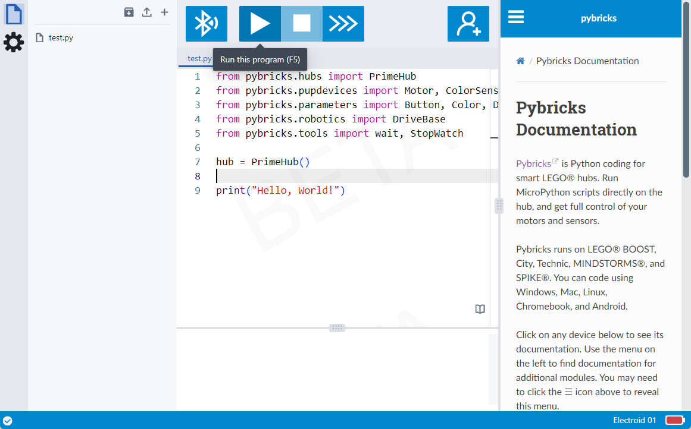

1. You should see "Hello, World" in the Output window.

    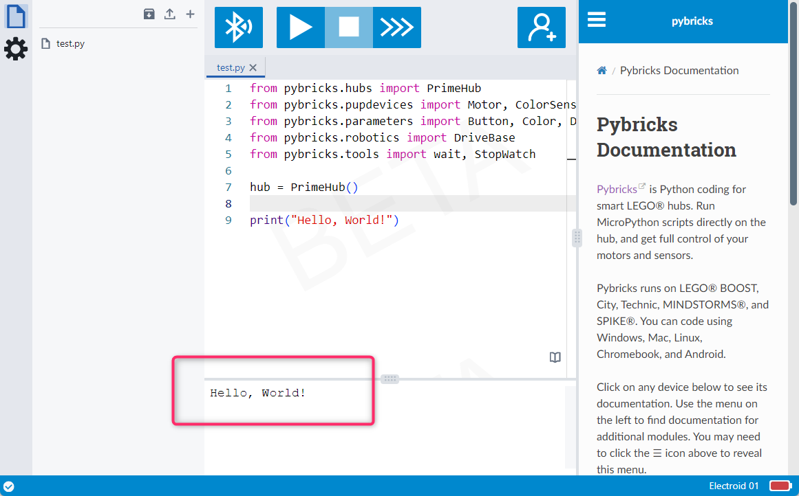

### Pybrick Classes

#### `drivebase`

Used to move the drivebase in a given direction

```python
motor_a = Motor(Port.A)
motor_b = Motor(Port.B,  Direction.COUNTERCLOCKWISE)

drive = DriveBase(left_motor=motor_a, 
                  right_motor=motor_b, 
                  wheel_diameter=53,
                  axle_track=129)

drive.straight(distance=100)
```

### Hub menu implementation

You can select your program with the buttons on the Hub by using `hub_menu` module.

1. Create the following 3 files in your file manager and copy each code contents.

    === "`main.py`"

        ```python
        from pybricks.tools import hub_menu

        selected = hub_menu("A", "B", "C")

        if selected == "A":
            import mission_1
        elif selected == "B":
            import mission_2
        elif selected == "C":
            import mission_3
        ```

    === "`mission_1.py`"

        ```python
        from pybricks.hubs import InventorHub
        from pybricks.pupdevices import Motor, ColorSensor, UltrasonicSensor
        from pybricks.parameters import Button, Color, Direction, Port, Side, Stop
        from pybricks.robotics import DriveBase
        from pybricks.tools import wait, StopWatch
        import constants

        wheel_e = Motor(Port.E, reset_angle=True)
        wheel_a = Motor(Port.A, Direction.COUNTERCLOCKWISE, reset_angle=True)

        front_arm = Motor(Port.D, reset_angle=True)

        drive = DriveBase(left_motor=wheel_a, 
            right_motor=wheel_e, 
            wheel_diameter=constants.WHEEL_DIAMETER,
            axle_track=constants.AXLE_LENGTH)

        drive.settings(straight_speed=500)
        drive.use_gyro(use_gyro=True)

        # go front before the turn
        drive.straight(20)

        # 
        drive.turn(89)

        drive.straight(175)

        front_arm.run_target(speed=500,target_angle=-180)

        drive.straight(-55)

        drive.settings(turn_rate=30)
        drive.turn(-40)

        front_arm.run_target(speed=500, target_angle=180)

        drive.turn(40)
        drive.straight(-200)
        ```

    === "`mission_2.py`"

        ```python
        from pybricks.hubs import PrimeHub
        from pybricks.pupdevices import Motor, ColorSensor, UltrasonicSensor, ForceSensor
        from pybricks.parameters import Button, Color, Direction, Port, Side, Stop
        from pybricks.robotics import DriveBase
        from pybricks.tools import wait, StopWatch
        import constants

        wheel_e = Motor(Port.E, reset_angle=True)
        wheel_a = Motor(Port.A, Direction.COUNTERCLOCKWISE, reset_angle=True)

        # setup the front motor which moves the arm up and down
        front_arm = Motor(Port.D, reset_angle=True)

        # setup the drive base
        drive = DriveBase(left_motor=wheel_a, 
            right_motor=wheel_e, 
            wheel_diameter=constants.WHEEL_DIAMETER,
            axle_track=constants.AXLE_LENGTH)

        # set our robots speed
        drive.settings(straight_speed=500)

        # use the in built gyroscope to adjust movement
        # TODO: read more about this in the documentation for robotics.DriveBase
        drive.use_gyro(use_gyro=True)

        # go straight a little distance
        drive.straight(200)

        # adjust heading by 20 degrees to the right
        drive.turn(20)

        # go remaining distance to mission
        drive.straight(200)

        # turn towards the target (target is on the left)
        drive.turn(-65)

        # get closer to the target
        drive.straight(15)

        # move the arm's motor to its 180 degree angle
        front_arm.run_target(speed=500,target_angle=-180)

        # step back
        drive.straight(-25)

        # raise the arm back to original position
        front_arm.run_target(speed=500,target_angle=180)

        # turn towards home
        drive.turn(65)

        # head home
        drive.straight(-400, then=Stop.COAST)
        ```

    === "`constants.py`"

        ```python
        #Dimensions of the robot in mm
        AXLE_LENGTH = 129
        WHEEL_DIAMETER = 53
        ```

1. Then make sure to open `main.py` in the code area, and then hit "**:material-play:(Run)**" button (or press ++f5++ key) 

    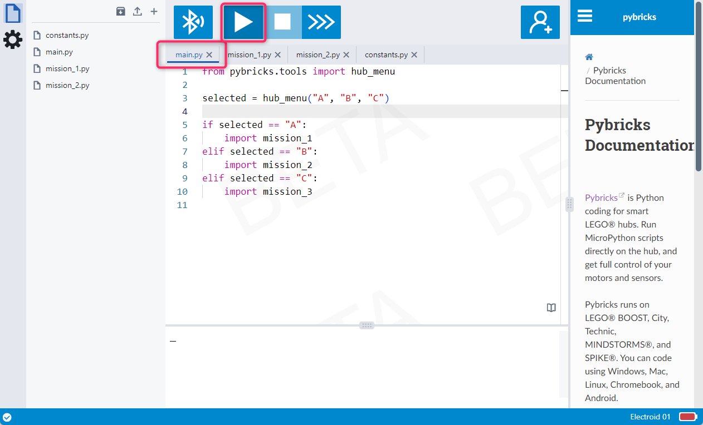

!!! example ""

    ✏️ Run the code and interacte with the menu on the Hub to understand how it works.

    - What happens when you select "A"?
    - What happens when it finishes executing `mission_1.py`?
    - What happens when you select "C"?
    
    ✏️ Also, try hitting the "**:material-play:(Run)**" button (or press ++f5++ key) while `mission_1.py` opened in the code area.

