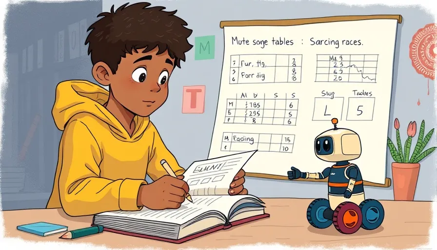
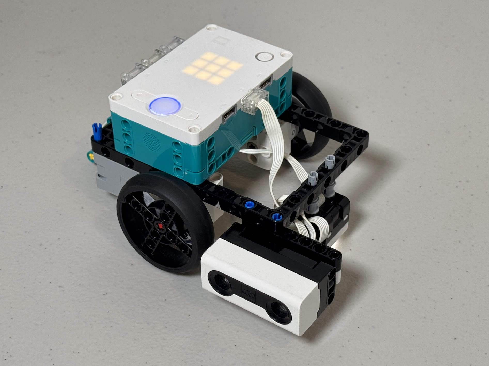
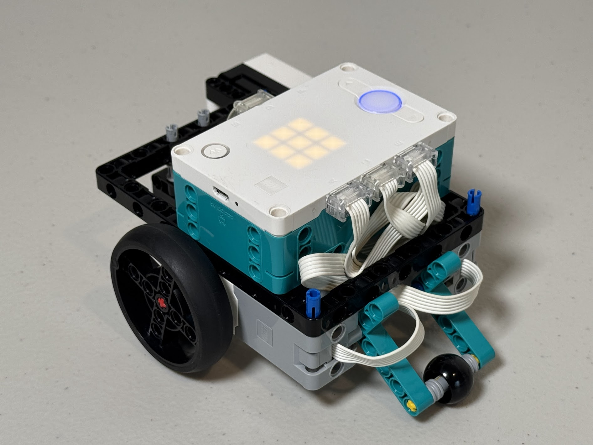
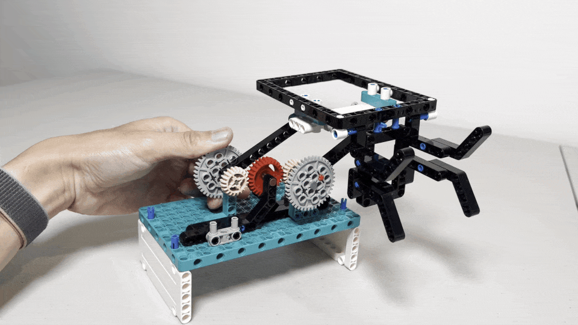

# Week 2 - Runnign Experiments

Hello, young engineers! 

Today’s mission: *experiment with our robots to find out their full potential*. 

Grab your notebooks and let’s start our journey of discovery!

## Labratory Notebook



Great discoveries start with great notes! 

Jotting things down in your lab notebook helps you remember your awesome ideas and learn from every experiment.

## Software Experiments

!!! note

    The folowoing codes are tested with a robot configured like this.

    { width="360" } { width="360" }

### Gyro - On and Off

Pybricks offer [`use_gyro()`](https://docs.pybricks.com/en/stable/robotics.html?highlight=gyro#pybricks.robotics.DriveBase.use_gyro) function to take advantage of the hub's internal IMU to keep robot's course.

Let's run an experiment to see the benefit of this function by running the following code.

!!! Tip

    The code uses [`hub_menu()`](https://docs.pybricks.com/en/stable/tools/index.html?highlight=hub_menu#pybricks.tools.hub_menu) function to let you **enable (`G`)** or **disable(`N`)** the gyro function.
    

=== "`gyro_test.py`"

    ```python
    from pybricks.tools import hub_menu
    from pybricks.hubs import PrimeHub
    from pybricks.pupdevices import Motor, ColorSensor, UltrasonicSensor
    from pybricks.parameters import Button, Color, Direction, Port, Side, Stop
    from pybricks.robotics import DriveBase
    from pybricks.tools import wait, StopWatch
    import constants

    print("Menu shown: G, N")
    selected = hub_menu("G", "N")

    wheel_e = Motor(Port.E, reset_angle=True)
    wheel_a = Motor(Port.A, Direction.COUNTERCLOCKWISE, reset_angle=True)

    drive = DriveBase(left_motor=wheel_a, 
        right_motor=wheel_e, 
        wheel_diameter=constants.WHEEL_DIAMETER,
        axle_track=constants.AXLE_LENGTH)

    drive.settings(straight_speed=920,
        straight_acceleration=900, 
        turn_rate=920, 
        turn_acceleration=900)

    if selected == "G":
        drive.use_gyro(use_gyro=True)
        print("### Gyro enabled")
    elif selected == "N":
        print("### Gyro disabled")

    drive.turn(360)
    wait(5000)          # wait 5 sec

    UNIT_LENGTH = 300

    # go NORTH
    drive.straight(UNIT_LENGTH * 2)
    drive.turn(90)
    print("Now facing EAST")

    # go EAST
    drive.straight(UNIT_LENGTH)
    drive.turn(90)
    print("Now facing SOUTH")

    # go SOUTH
    drive.straight(UNIT_LENGTH)
    drive.turn(90)
    print("Now facing WEST")

    # go WEST
    drive.straight(UNIT_LENGTH)
    drive.turn(90)
    print("Now facing NORTH")

    # go back to ORIGIN
    drive.straight(-UNIT_LENGTH)
    print("Back to (supporsedly) the original position")
    ```


=== "`constants.py`"

    ```python
    #Dimensions of the robot in mm
    AXLE_LENGTH = 111
    WHEEL_DIAMETER = 55
    ```

!!! example "Exercise"

    Summerize your observation on your notebook.

    |  | 🔔 Gyro On| 🔕 Gyro Off |
    | ---- | ---------------- |---------------- |
    | Your observation |              |              | 

    Are there any other variables that impact the result? How about the smoothness of the floor?

    |  | 🔔 Gyro On| 🔕 Gyro Off |
    | ---- | ---------------- |---------------- |
    | Smooth surface |              |              | 
    | Rough surface |              |              | 

### Sensor feedback (Ultrasonic sensor) - On and Off

We have been relying on **dead reckoning** to have our robot navigate on the game mat.

Let's explore alternative navigation method, this time using a feedback from the ultrasonic sensor to keep a certain distance from a side wall.

!!! Tip

    The code below assumes that you mount the ultrasonic distance sensor on the right hand side of the robot.
    
    It uses [`hub_menu()`](https://docs.pybricks.com/en/stable/tools/index.html?highlight=hub_menu#pybricks.tools.hub_menu) function to let you **enable (`F`)** or **disable(`N`)** the sensor feedback.
    
=== "`feedback_test.py`"

    ```python
    from pybricks.tools import hub_menu
    from pybricks.hubs import PrimeHub
    from pybricks.pupdevices import Motor, ColorSensor, UltrasonicSensor
    from pybricks.parameters import Button, Color, Direction, Port, Side, Stop
    from pybricks.robotics import DriveBase
    from pybricks.tools import wait, StopWatch, hub_menu
    import constants

    print("Menu shown: F, N")
    selected = hub_menu("F", "N")

    if selected == "F":
        sensor_feedback = True
        print("### Sensor feedback enabled")
    elif selected == "N":
        sensor_feedback = False
        print("### Sensor feedback disabled")

    wheel_e = Motor(Port.E, reset_angle=True)
    wheel_a = Motor(Port.A, Direction.COUNTERCLOCKWISE, reset_angle=True)

    drive = DriveBase(left_motor=wheel_a, 
        right_motor=wheel_e, 
        wheel_diameter=constants.WHEEL_DIAMETER,
        axle_track=constants.AXLE_LENGTH)

    drive.settings(straight_speed=920,
        straight_acceleration=900, 
        turn_rate=920, 
        turn_acceleration=900)

    drive.use_gyro(use_gyro=True)

    rangesensor = UltrasonicSensor(port=Port.D)

    TARGET_DISTANCE = 200   # Try to keep 20cm away from a wall on the right
    LOW_SPEED  = 80
    HIGH_SPEED = 300

    count = 0
    SPEEDUP_COUNT = 100
    END_COUNT = 500

    while True: 
        
        distance = rangesensor.distance()
        
        if sensor_feedback:
            if count < SPEEDUP_COUNT:
                correction_angle = (distance - TARGET_DISTANCE)*2
                print(f"{count:04} ... Measured: {distance}, correction_angle: {correction_angle}")
                drive.drive(LOW_SPEED, correction_angle)   
            else:
                correction_angle = (distance - TARGET_DISTANCE)
                print(f"{count:04} >>> Measured: {distance}, correction_angle: {correction_angle}")
                drive.drive(HIGH_SPEED, correction_angle)
        else:
            print(f"{count:04} ||| Measured: {distance}")
            drive.drive(HIGH_SPEED, 0)
        
        count = count + 1
        if count > END_COUNT:
            drive.stop()
            break
    ```

=== "`constants.py`"

    ```python
    #Dimensions of the robot in mm
    AXLE_LENGTH = 111
    WHEEL_DIAMETER = 55
    ```

!!! example "Exercise"

    Summerize your observation on your notebook.

    | Mode | When aligned<br> perfectly | When alignment<br> slightly off | When alignment<br> wildly off |
    | ---- | ---------------- | ---------------- | ---------------- |
    | 🔔 Feedback On  |              |              |              |
    | 🔕 Feedback Off |              |               |              |

### Speed test

!!! example "Exercise"

    1. Create a program (or modify the existing codes) to test various speed and acceleration.<br> Record each result and examine the effect on accuracy.

    2. Repeat the same for acceleration.

    3. Record each result and summerize your observation.

??? Success "Solution"

    !!! tip

        By nesting the `hub_menu()` function, you can create mutliple-stage menu structure.

    === "`gyro_test_varispeed.py`"

        ```python
        from pybricks.hubs import PrimeHub
        from pybricks.pupdevices import Motor, ColorSensor, UltrasonicSensor, ForceSensor
        from pybricks.parameters import Button, Color, Direction, Port, Side, Stop
        from pybricks.robotics import DriveBase
        from pybricks.tools import wait, StopWatch, hub_menu
        import constants

        hub = PrimeHub()

        wheel_e = Motor(Port.E, reset_angle=True)
        wheel_a = Motor(Port.A, Direction.COUNTERCLOCKWISE, reset_angle=True)

        drive = DriveBase(left_motor=wheel_a, 
            right_motor=wheel_e, 
            wheel_diameter=constants.WHEEL_DIAMETER,
            axle_track=constants.AXLE_LENGTH)

        selected_speed = 1

        while True:
            print("Menu shown: G, N, 1")
            selected = hub_menu("G", "N", "1")

            if selected == "G":
                drive.use_gyro(use_gyro=True)
                print("### Gyro enabled")
                break
            elif selected == "N":
                print("### Gyro disabled")
                break
            elif selected == "1":
                print("Menu shown: 1, 2, 3, 4, 5, 6, 7, 8, 9")
                selected_speed = hub_menu(1, 2, 3, 4, 5, 6, 7, 8, 9)

        speed = selected_speed*100

        drive.settings(straight_speed=speed,
            straight_acceleration=900, 
            turn_rate=speed, 
            turn_acceleration=900)

        drive.turn(360)
        wait(2000)          # wait 2 sec

        UNIT_LENGTH = 300

        # go NORTH
        drive.straight(UNIT_LENGTH * 2)
        drive.turn(90)
        print("Now facing EAST")

        # go EAST
        drive.straight(UNIT_LENGTH)
        drive.turn(90)
        print("Now facing SOUTH")

        # go SOUTH
        drive.straight(UNIT_LENGTH)
        drive.turn(90)
        print("Now facing WEST")

        # go WEST
        drive.straight(UNIT_LENGTH)
        drive.turn(90)
        print("Now facing NORTH")

        # go back to ORIGIN
        drive.straight(-UNIT_LENGTH)
        print("Back to (supporsedly) the original position")
        ```

### 🎁 Bonus 

Run the following code 🎶.

*Credit: [FTC team 23247 the Monongahela Cryptid Cooperative](https://github.com/MonongahelaCryptidCooperative/FLL-2023-old/blob/main/mcc_icons_music.py)*

=== "`melody.py`"

    ```
    from pybricks.hubs import PrimeHub

    hub = PrimeHub()

    x0 = ["D4/12", "D4/12", "D4/12"]
    x1 = ["G4/2", "D5/2"]
    x2 = ["C5/12", "B4/12", "A4/12", "G5/2",  "D5/4"]
    x3 = ["C5/12", "B4/12", "C5/12", "A4/2",  "D4/6", "D4/12"]
    x4 = ["E4/4.", "E4/8", "C5/8", "B4/8",  "A4/8", "G4/8"]
    x5 = ["G4/12", "A4/12", "B4/12", "A4/6", "E4/12", "F#4/4", "D4/6", "D4/12"]
    x6 = ["D5/4", "A4/2", "D4/6", "D4/12"]
    x7 = ["G4/12", "A4/12", "B4/12", "A4/6", "E4/12", "F#4/4", "D5/6", "D5/12"]
    x8 = ["G5/6", "F5/12", "Eb5/6", "D5/12", "C5/6", "Bb4/12", "A4/6", "G4/12"]
    x9 = ["D5/2."]
    x10 = ["G5/12", "F5/12", "Eb5/12", "Bb5/2", "A5/4", "G5/8", "R/8", "G4/12", "G4/12", "G4/12", "G4/4"]
    test = x0 + x1 + x2 + x2 + x3 + x1 + x2 + x2 + x3 + x4 + x5 + x4 + x6 + x4 + x7 + x8 + x9 + x0 + x1 + x2 + x2 + x3 + x1 + x2 + x10
    hub.speaker.play_notes(test)
    ```

!!! example "Exercise"

    Had fun? Try the other programs from **[FTC team 23247 the Monongahela Cryptid Cooperative](https://github.com/MonongahelaCryptidCooperative/)**

    - [FLL-2023-old](https://github.com/MonongahelaCryptidCooperative/FLL-2023-old)
        - [`mcc_icons_music.py`](https://github.com/MonongahelaCryptidCooperative/FLL-2023-old/blob/main/mcc_icons_music.py) : You can create your own icons as well! 


## Hardware Experiments

### Non-linear mechanism



!!! abstract "Homework"

    ## Homework for next session

    - [ ] Create GitHub account

    !!! warning

        Currently, it is not possible for a minor (age under 13) to create a GitHub account...

        So we need to find some way around...
